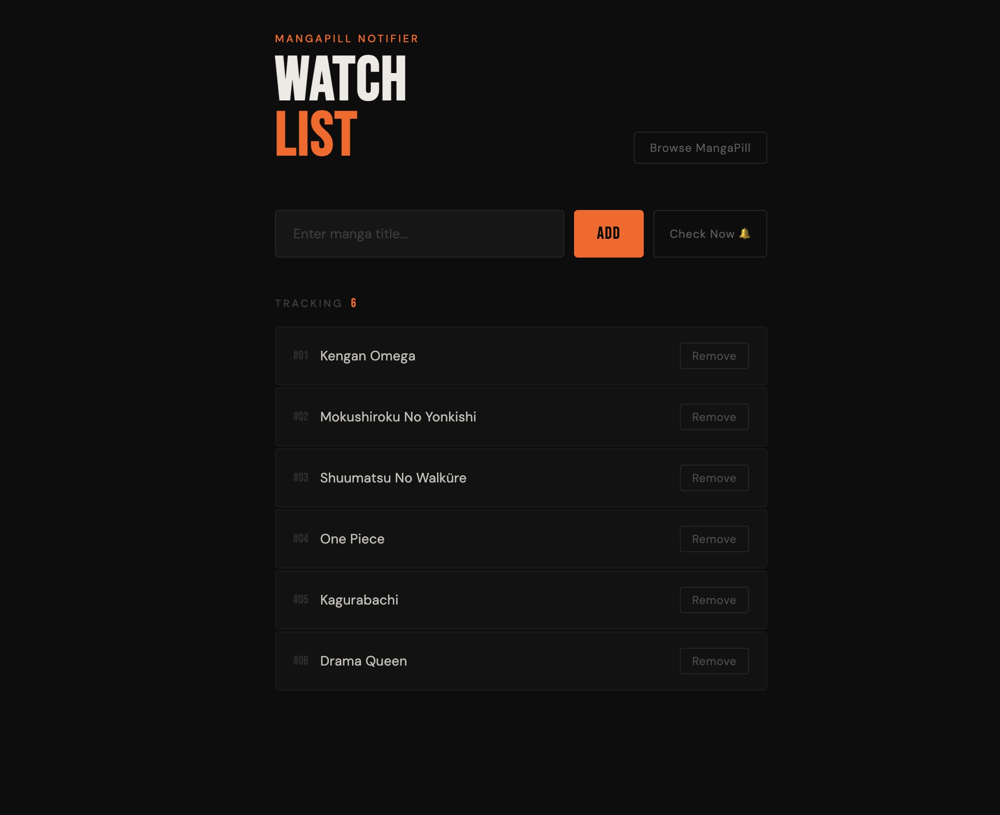
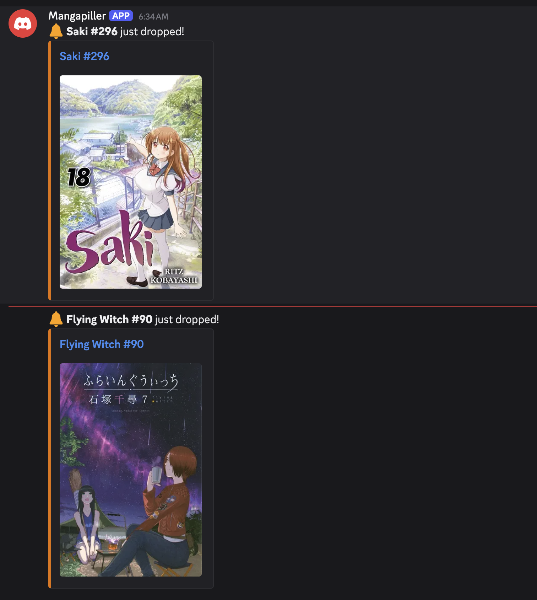

# 🥭 Manga Notifier

Automatically scrapes [MangaPill](https://mangapill.com/chapters) and sends a Discord DM when a new chapter drops for your favorite manga.

## 📸 Screenshots

### Web UI


### Discord Notification


## ✨ Features
- Scrapes MangaPill every 24h automatically
- Sends Discord DM with chapter thumbnail
- `/check` slash command to trigger an immediate check
- Web UI to manage your favorite manga list
- SQLite storage, persists across Docker restarts

## 🚀 Setup

### 1. Clone the repo
```bash
git clone https://github.com/nqlongdl/mangapiller.git
cd mangapiller
```

### 2. Create a Discord Bot
1. Go to [Discord Developer Portal](https://discord.com/developers/applications)
2. New Application → Bot → Reset Token → copy the token
3. Enable **Message Content Intent** if needed
4. Invite the bot to your server to use the `/check` slash command

### 3. Create the .env file
```bash
cp .env.example .env
```
Fill in `.env`:
```env
DISCORD_TOKEN=your_bot_token
DISCORD_USER_ID=your_discord_user_id  # right-click your name → Copy User ID
CHECK_INTERVAL=86400                   # in seconds, default 24h
```

### 4. Run
```bash
docker compose up --build
```
Web UI available at `http://localhost:8000`

## 🤖 Discord Commands
| Command | Description |
|---------|-------------|
| `/check` | Trigger an immediate chapter check without waiting 24h |

## 📁 Project Structure
```
├── backend/
│   ├── main.py       # Discord bot + scraper
│   ├── api.py        # FastAPI endpoints
│   ├── db.py         # SQLite
│   ├── config.py     # Load env vars
│   └── logger.py
├── frontend/
│   ├── src/
│   │   └── App.jsx   # React UI
│   └── index.html
├── docker-compose.yml
├── Dockerfile
└── .env.example
```

## 🔌 API
| Method | Endpoint | Description |
|--------|----------|-------------|
| GET | `/api/favorites` | List all tracked manga |
| POST | `/api/favorites` | Add manga (`{"title": "..."}`) |
| DELETE | `/api/favorites` | Remove manga (`{"title": "..."}`) |
| POST | `/api/check` | Trigger immediate check |

## 📝 Notes
- Manga title only needs to **partially match** the title on MangaPill (case-insensitive)
- `/check` only notifies chapters released **today**, not full history
- Changing `.env` only requires `docker compose up`, no `--build` needed
- `--build` is only needed when changing code